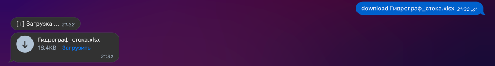

# Telegram-Helper_for_PC

---------------------
Телеграм бот предназначен для получения удаленного доступа к ПК.

При запуске бота на Windows/Linux/Mac вы получаете доступ к консоле устройства:
- Можно просматривать данные
- Передвигаться между директориями 
- Скачивать и загружать данные 
- Смотреть информацию о компьютере, состояние сети, подключенных устройствах... и т.п.
- Можно выполнять большенсвто команд вашей OS
---------------------
Большенство команд консоли можно вызвать так: \
$ <название команды> 

Или так(получение вывода команды в файле txt): \
$f <название команды> 

Для перемещения по директориям: \
cd ..
cd <название папки>

Для загрузки файла с ПК: \
download <название файла >

Для загрузки файла на ПК: \

---------------------
На момент создания использовался Python 3.9.7 и библиотека pyTelegramBotAPI 4.4.0 \
При проблемах с установкой pyTelegramBotAPI: \
pip3 uninstall telebot \
pip3 uninstall PyTelegramBotAPI \
pip3 install pyTelegramBotAPI \
pip3 install --upgrade pyTelegramBotAPI \
---------------------
Для облегчения запуска программы можно использовать pyinstaller: \
Переходим в папку с HelperBotV1.py и выполняем команду \
pyinstaller -F -w HelperBotV1.py \
В папке dist появляется исполняемый файл, остальные файлы можно удалить

! При запуске exe файла на windows есть проблема кодировки, для испраления надо установить UTF-8 активным \
в настройках параметра языка \

